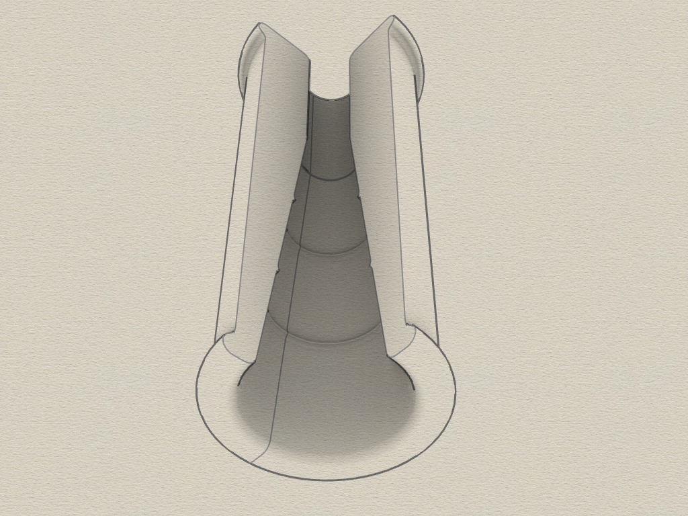
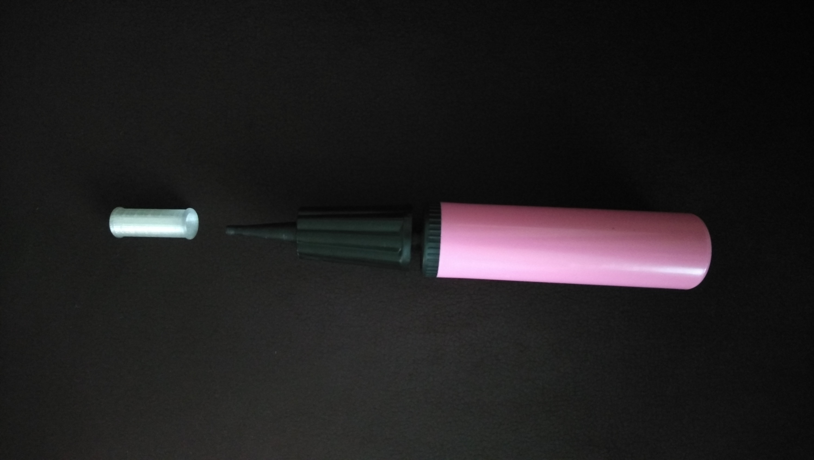
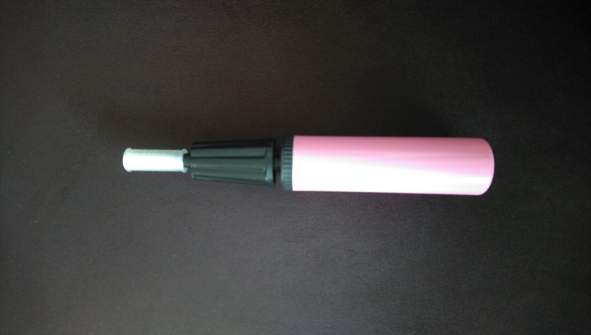
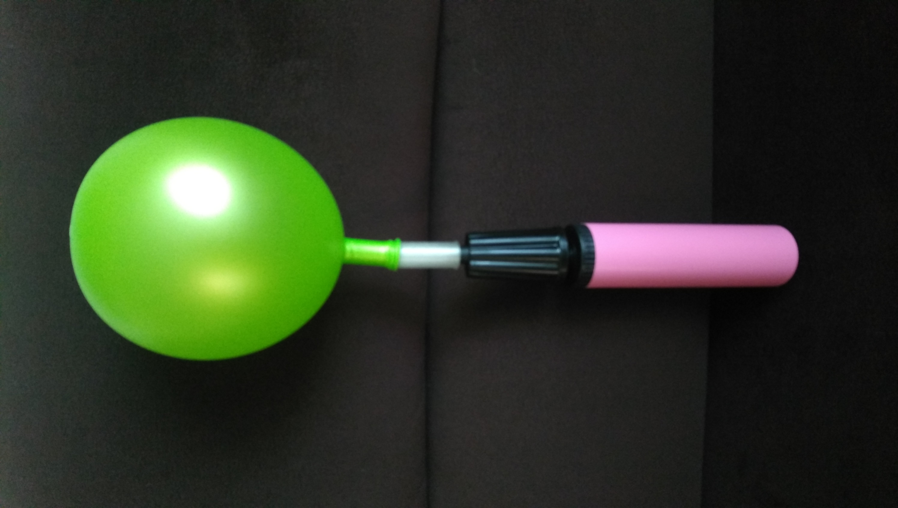

# Balloon Air Pump Adapter
3D printable adapter for balloon air-pump.

## Adapter

The Adapter is for use with a balloon air-pump.

Requirements:
* 3D printer 
* Filament of your choice

## View
 
 
 
 
 

